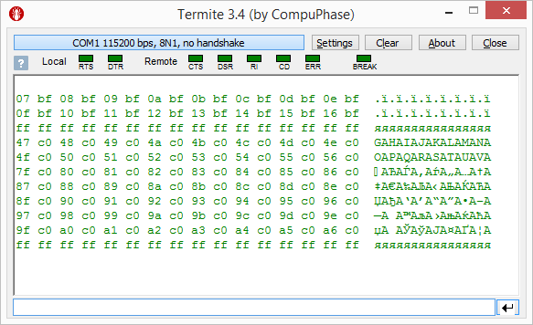

#### mpcanflash

This is a fork of the [mphidflash](https://github.com/ApertureLabsLtd/mphidflash) utility adapted to use with [CAN Bootloader](https://github.com/qnx425/PIC18FXXK80-CAN-Bootloader). There are no functional but technical changes only.

It is assumed that target PIC18FXXK80 MCU has pre-installed [CAN Bootloader](https://github.com/qnx425/PIC18FXXK80-CAN-Bootloader) firmware and works as a CAN-bus node. 

To download a new program to your MCU, you must connect your PC to CAN bus with [USBtin](https://fischl.de/usbtin/), [CAN232](https://www.can232.com/?page_id=14) or [CANUSB](https://www.can232.com/?page_id=16) device. And even [ELM327SLCAN](https://github.com/qnx425/ELM327SLCAN).

##### Building and Installing

To build mpcanflash for Windows, you can use mingw32 compiler. In the Windows commmand line window type:

	mingw32-make

This will create a mpcanflash.exe in the bin sub-directory, which can be called from the Windows commmand line. You should copy this file somewhere on your executable path.

##### Usage

For a description of all available options type: mpcanflash -h

For comprehensive information about the device operation read carefully 'Device - Boot Loader - HID' chapter in 'help\_mla\_usb' document from [Microchip Libraries for Applications](https://www.microchip.com/mplab/microchip-libraries-for-applications) collection.

##### Examples

First you can try to download some piece of firmware for test purposes, without signing. This allows MCU firmware to stay in boot mode and return some information.  
For example, download [test1.hex](test/test1.hex) or [test2.hex](test/test2.hex) as shown below.

After typing 'g' command in [Termite](https://www.compuphase.com/software_termite.htm) window you get response:

  
or  

Later you can download real working [firmware](test/app.hex), sign it ...

  

... and watch that [it](test/mpcanflash.txl) works.  

